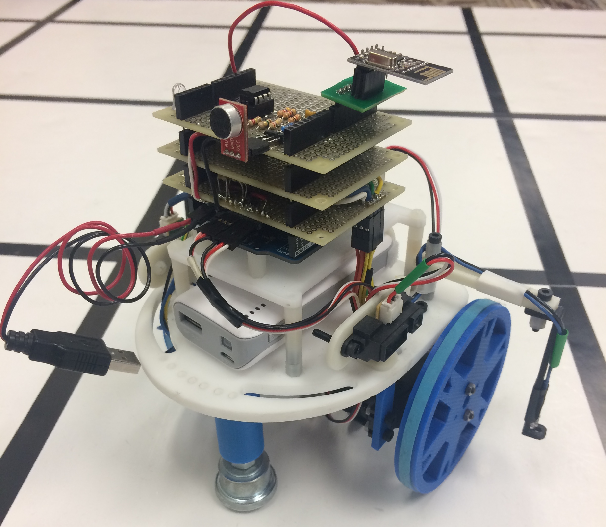

# ECE 3400, Fall 2017
## Team Alpha
### Team members: Claire Chen(clc288), Christopher Fedors (cjf83), Ryan O'Hern (rmo26), and Kirstin Petersen (khp37)

This website contains useful links, our (simple) solutions to the labs, and a very brief description of our final robot. We hope you will find it useful and create much better websites yourselves!

* [Lab 1: Microcontrollers](./docs/lab1.md)
* [Lab 2: Signal Processing](./docs/lab2.md)
* [Lab 3: FPGA](./docs/lab3.md)
* [Lab 4: Wireless](./docs/lab4.md) 
* [Milestone 1](./docs/milestone1.md) 
* [Milestone 2](./docs/milestone2.md)
* [Milestone 3](./docs/milestone3.md)
* [Milestone 4](./docs/milestone4.md)

### Final Robot

ADD DESCRIPTION OF COMPONENTS!

