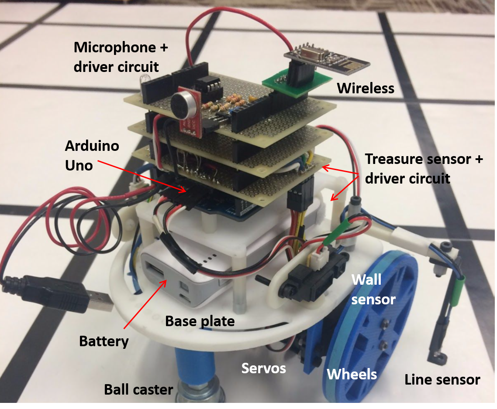

# ECE 3400, Fall 2017
## Team Alpha 
### Claire Chen and Ryan O'Hern

This website contains useful links, and our (simple) solutions to the labs and milestone. We hope you will find it useful and create much better websites yourselves! 

*Remember, you will also have to add pages detailing the final design of your robot.*

***

* [Lab 1: Microcontrollers](lab1.md)
* [Lab 2: Signal Processing](lab2.md)
* [Lab 3: FPGA](./lab3.md)
* [Lab 4: Wireless](lab4.md)
* [Milestone 1](milestone1.md) 
* [Milestone 2](milestone2.md)
* [Milestone 3](milestone3.md)
* [Milestone 4](milestone4.md)

***

Here's our final robot:

