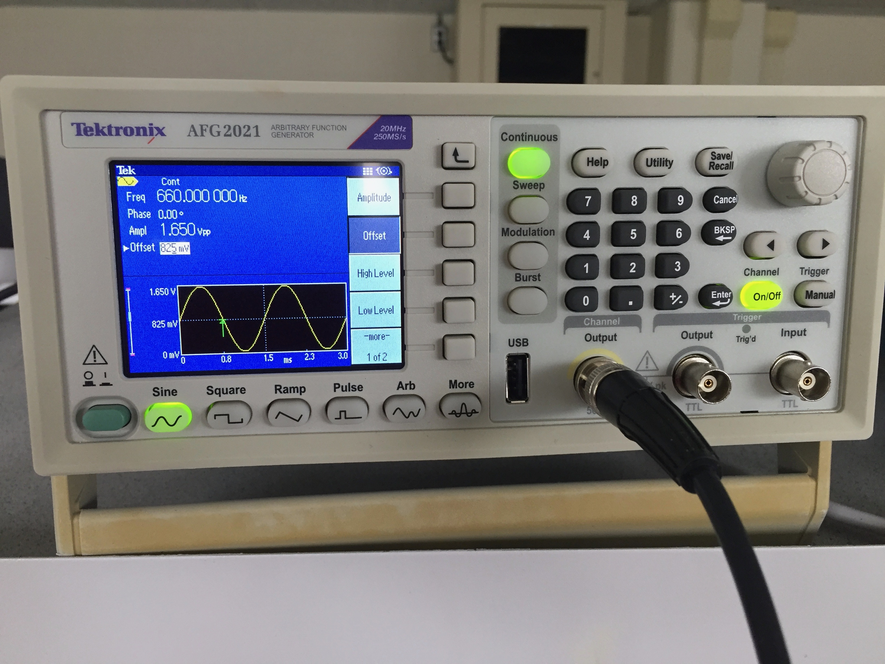
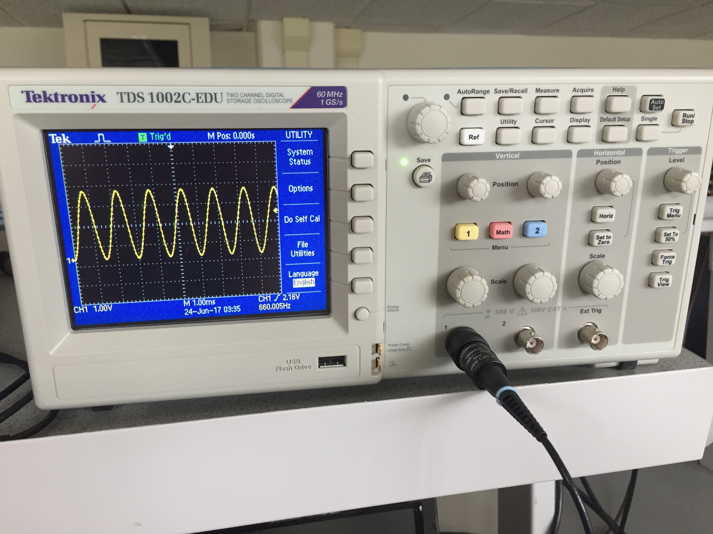
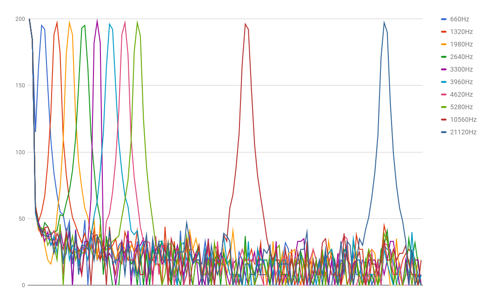
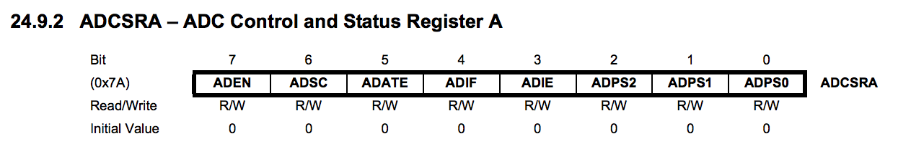
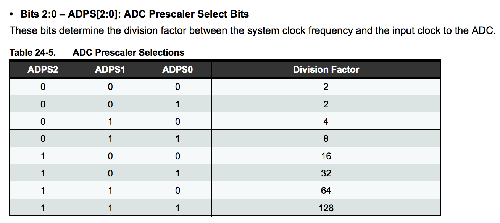
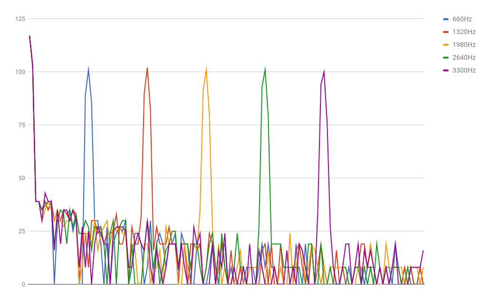
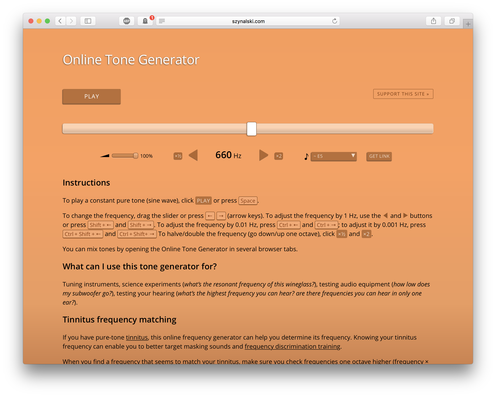
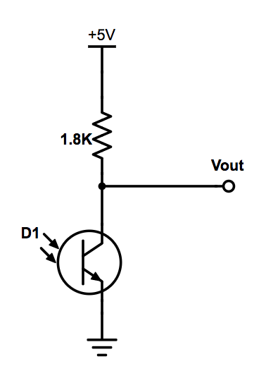
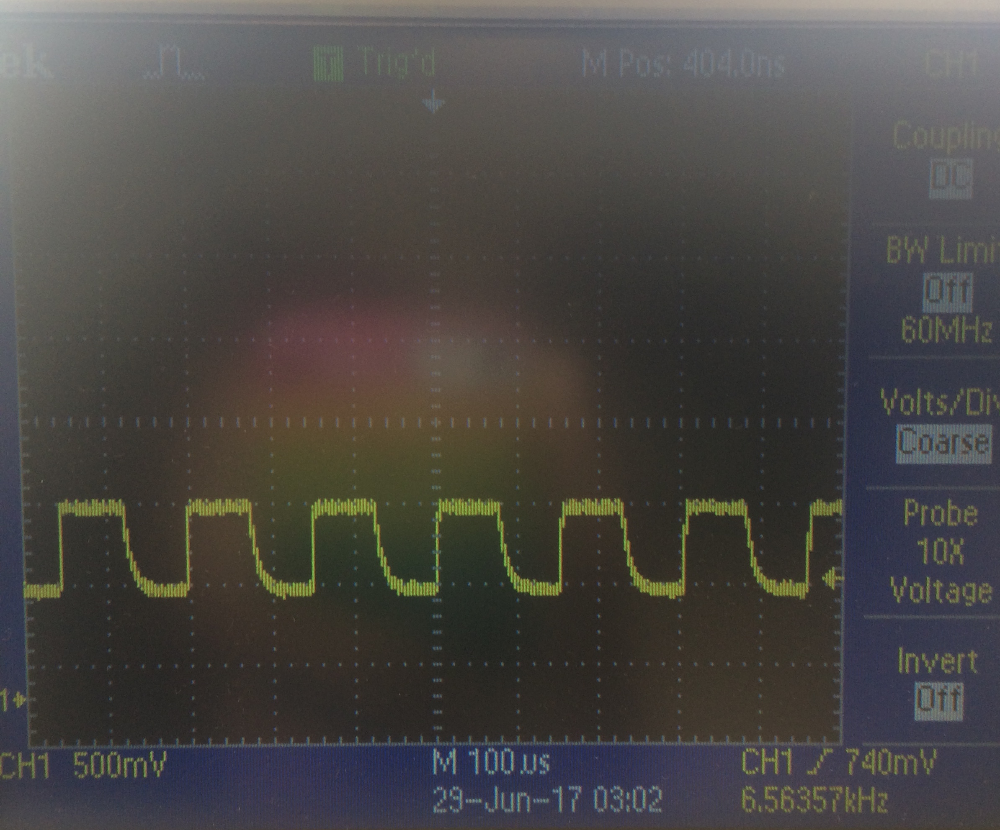

# ECE 3400, Fall'17: Team Alpha
## Lab 2: Analog Circuitry and FFTs

*By Ryan O'Hern and Claire Chen, June 15th 2017*

### Goals

The purpose of this lab is to add sensors and signal processing to the robot. Since we will need to use filters for several of the sensors, it makes sense to implement a digital filter instead of many analog filters. To do this, we worked with the Open Music Lab FFT library for the Arduino. One sub-team, composed of Ryan O'Hern, attached a microphone to distinguish a 660Hz audible start signal; the other sub-team, composed of Claire Chen, attached a IR sensitive transistor to distinguish between treasures emitting IR at 5 different frequencies (from 7-17kHz). 

### Team Acoustic

First, we red up on the FFT library. The accuracy of our FFT depends on the sampling frequency of our computation, *Fs*, which in turn is determined by the clock speed of the Arduino (16MHz), and the conversion rate of the ADC. We therefore took a closer look at how the ADC works. 

The [datasheet](http://www.atmel.com/Images/Atmel-42735-8-bit-AVR-Microcontroller-ATmega328-328P_Datasheet.pdf) (starting page 305) informs us of the following:
* The ADC can have up to 10bit accuracy
* The clock of the ADC can be set by writing the last three bits in the ADCSRA register. With a 16MHz crystal, it can be set to 8MHz, 4MHz, 2MHz, 1MHz, 500kHz, 250kHz, and 125kHz. (However, at frequencies higher than 250kHz the 10-bt accuracy degrades)
* The input to the ADC can be set using the last four bits of the register ADMUX. For a standard 10-bit conversion, the output will be stored in ADCL and ADCH. The value will correspond to 1024 * [analog input voltage]/5V. 
* If the resolution is set to 10-bits, a conversion takes 13 clock cycles. The default configuration for the ADC clock is 125kHz, therefore the maximum default sampling frequency is 125000 / 13 = 9600Hz.  
* Note that upon activation, the ADC take 15 clock cycles to get ready.
* The ADC can be run either via repetetively calling analogRead, or in Free Running Mode where it continuous updates the ADCL and H registers. Next we tried both versions of the ADC.

#### Free Running Mode: fft_adc_serial

* We added the Open Music Lab FFT library to our Arduino IDE by copying the directory into the 'libraries' folder.

* We started by running the example script *fft_adc_serial*. Before jumping to sampling data from the microphone, we first tested this script using the function generator in the lab.

* We set the function generator to 660Hz, 1.65Vpp (3.3V/2), with a 0.825V offset (1.65V/2). We confirmed these settings with the oscilloscope.




* We then captured data using the fft_adc_serial script from the Open Music Lab library. This script is set to collect 256 samples each run of the FFT. Running at a sampling frequency of 9600Hz, this gives the FFT bins a width of 9600 / 256 = 37.5Hz. This means that we can expect to see the 660Hz signal in bin number 17: 660Hz / 37.5Hz = 17.6.

* However, with an input of 660Hz we found an unusual result: the peak for the 660Hz tone appears in the 5th bin!

* One reason to use the function generator to create our input is that it makes changing that input simple. We gathered samples for integer multiples of 660Hz, first to investigate if the FFT algorithm was behaving sensibly at all and second to get an idea of what the sampling frequency, Fs, might be to produce this result. We copied all of the data into Excel, to see get a visual output.



* The peak for each frequency appears in the following bins: (660: 5), (1320: 10), (1980: 14), (2640: 19), (3300: 23), (3960: 27), (4620: 32), (5280: 36), (10560: 71), (21120: 116).

* As you can see from the graph, the FFT algorithm is behaving sensibly. The integer multiples of 660Hz appear in equally spaced bins. Strangely, we are able to detect much higher frequencies than expected. According to the Nyquist–Shannon sampling theorem, the highest frequency we should be able to detect is Fs/2. Yet, we can correctly discern frequencies far above 9600Hz/2.

* This suggests that we are sampling at over 40kHz. Our reasoning is as follows: 
1.  40kHz / 256 samples = 156Hz/sample
2.  660Hz appears in the 5th bin: 5bins * 156Hz/sample = 780
3.  780 - 156Hz/sample = 624Hz. So with this sampling frequency, 660Hz would indeed appear in the 5th bucket.

* Remembering that the ADC clock is set by the main clock speed divided by a power of 2, there are only a few possibilities for the ADC sampling frequency. The closest is ~38kHz (= 16MHz / 32 prescalar / 13 clock cycles). 38kHz / 256 samples = 148.4Hz per bin in our FFT. This matches up well with our results. Knowing this, we have strong reason to suspect that the default settings for the ADC clock are being modified somewhere by our FFT library or by the script we are running.

* Looking more closely at the fft_adc_serial script, we noticed there is an obvious suspect line:
``` C
void setup() {
  Serial.begin(115200);
  TIMSK0 = 0;
  ADCSRA = 0xe5; // <-- THIS LINE
  ADMUX = 0x40;
  DIDR0 = 0x01;
}
```
* The ADC clock prescalar is adjusted by this script before the FFT runs! 0xe5 is hexidecimal for 11100101, so the final 3 bits are 101. According to this table taken from the datasheet, that gives a prescalar of 32, not the default of 128! This means the ADC clock is running at 500kHz, explaining our FFT output. *....This is why commenting all lines of code can be helpful!*





* Note that the datasheet also indicates that running the ADC clock this fast will lower precision: "By default, the successive approximation circuitry requires an input clock frequency between 50kHz and 200kHz to get maximum resolution. If a lower resolution than 10 bits is needed, the input clock frequency to the ADC can be higher than 200kHz to get a higher sample rate." (page 240)


#### Using analogRead(): fft_analogread

* We also modified the fft_adc_serial script to use analogRead(), the built-in method for reading an analog input, instead of running the ADC in free-running mode.

```C
void setup() {
  Serial.begin(115200); // use the serial port
}

void loop() {
  while(1) {
    cli();
    for (int i = 0 ; i < 512 ; i += 2) {
      fft_input[i] = analogRead(A0); // <-- NOTE THIS LINE
      fft_input[i+1] = 0;
    }
    fft_window();
    fft_reorder();
    fft_run();
    fft_mag_log();
    sei();
    Serial.println("start");
    for (byte i = 0 ; i < FFT_N/2 ; i++) {
      Serial.println(fft_log_out[i]);
    }
  }
}
```

* We ran the same tests using our function generator, and Excel, and got a much different output than the fft_adc_serial script.



* The peak for each frequency appears in the following bins: (660: 20), (1320: 39), (1980: 58), (2640: 77), (3300: 96). Obviously the sampling frequency is much lower when using analogRead() compared to free running mode. Arduino makes available a script called [ShowInfo](https://playground.arduino.cc/Main/ShowInfo) that provides a speed test that gives the time taken to do an analogRead(). The results for our Arduino look like:
```
Speed test
----------
F_CPU = 16000000 Hz
1/F_CPU = 0.0625 us
The next tests are runtime compensated for overhead
Interrupts are still enabled, because millis() is used for timing
  ...
  analogRead()              : 111.987 us
  ...
-----------
```

* One analogRead() takes 111.987us, giving a sampling frequency of 1 / 0.000111987 = ~8930Hz. 8930Hz / 256 = 34.9Hz. This means our bins are sensible, but off by ~15Hz. This is likely due to the extra clock cycles it takes to run our for-loop. But could also be because of variance in the time taken to run analogRead() (if, for example, other interrupts happen during execution), or because the FFT algorithm has limited precision.

#### Testing the Microphone

* First, we found a nice [web application to generate a tone](http://www.szynalski.com/tone-generator). 



* We then tested the microphone by connecting it to an oscilloscope, and realized that we would need to amplify the signal in order for the ADC to read it. 

* We assembled our microphone with an analog filter and amplifier as shown here:


* We tested that this worked using a signal generator and the oscilloscope.

* We then connected the output to pin A0 on our Arduino, such that when we played a 660Hz tone next to the microphone it gave us the expected spike in bin 5 (using the fft_adc_serial script).

### Treasure Team

* First, we followed the same steps described above to check that the FFT code was working.

* We use a phototransistor to detect the IR LED treasure with the simple circuit below. Under light, a phototransistor lets current pass - like a closed switch. In darkeness, it lets less current pass - like a closed switch. Using the circuit below, we saw a higher output voltage when we covered the phototransistor and a lower output voltage when we exposed the phototransistor to light. The change in voltage you saw at the output was small (less than 1 V), but this was still enough for the FFT to work on the unamplified signal. 



* By holding the transistor towards the window (sunlight contains IR) and towards the flourescent lights (these flicker at about 120Hz), we checked whether or not we needed to worry about unwanted signals at DC and 120Hz. It seems that a filter (analog or digital) might be worth the trouble. 

* This is the output of the circuit when we held a transmitting treasure close to the phototransistor: 



* To confirm the frequency, we also checked the frequency set on our treasure by directly probing the IR LED.

* To find the frequency of the blinking treasure, we connected the output of the phototrasistor to pin A0 on our Arduino and moved the treasure near to the IR sensor. We expect each bin to be about 150 Hz, calculated from [(16 MHz / 32 prescalar) / 13 clock cylces] / 256 bins. 

* Since the signal we get out of the phototransistor is not a pure sine wave, we expect to see multiple peaks in the FFT. For example, when detecting a 7kHz signal, we expect to see the main peak in bin number 46 or 47, and several more harmonics at higher frequencies. (The graph also shows the FFT results for 4 other frequencies, ranging from 7kHz to 17kHz.)


* In the future we also plan to investigate a simpler solution where we just detect the time between measured IR pulses. This will be less robust, but perhaps worth the save in memory.

