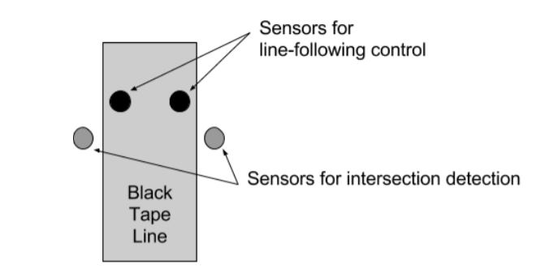

# ECE 3400, Fall'17: Team Alpha

*By Claire Chen, June 20th*

## Milestone 1: Line-following

### Goal

The goal of this milestone was to add sensors and feedback control to our robot.

### Following a Line

First, we worked on getting the robot to follow a black line on a white background. We began by testing the line sensors to get a sense of what values to expect over light and dark surfaces. This was how we determined the threshold values in the Arduino code. Once we could determine if of the center of the robot was over a light or dark surface, we used this information to write a simple control algorithm: 
```C
If left front sensor is equal to right front sensor:
  Go straight
Else if left front sensor sees white:
  Adjust right (run left motor faster than right motor)
Else if right front sensor sees white:
  Adjust left (run right motor faster than left motor)
```

We used four QRE113 line sensors arranged in the following configuration. As noted in the image, the center two sensors are for keeping the robot aligned forward, and the two outer sensors are for detecting when the robot has reached an intersection. 



We needed to connect the sensors to the Arduino via an analog multiplexer (mux) since we ran out of analog pins on our final robot. The mux we used has 3 select pins, which are connected to digital pins on the Arduino. The select pins are used to choose from one of the eight analog inputs on the mux. The zInput pin on the mux is connected to an analog pin on the Arduino.

See video of robot following a line here:

[](http://www.youtube.com/watch?v=TijvBkSl2sc)

### Driving in a Figure-Eight

Next, we added turning functionality. As mentioned above, we used two additional line sensors to detect when a robot has arrived at an intersection. Our turning algorithm assumes that the robot is at an intersection. The robot begins its turn by turning off the current line that it is on, and stops turning when the two center sensors have found a new line.

See video of robot moving in a figure-eight here:

[](http://www.youtube.com/watch?v=rAPimu52CVM)
