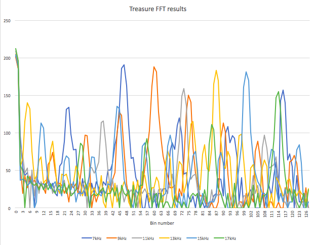
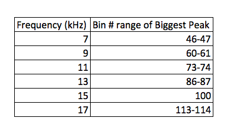

# ECE 3400, Fall'17: Team Alpha

*By Claire Chen, June 20th*

## Milestone 2: Wall and Treasure Detection
### Goal
The goal of this milestone was to add wall and treasure detection to the robot.

### Treasure Detection
Fortunately, we got our treasure detection working really well in lab 2. Recall this graph with the FFT analysis of 5 different treasures ranging from 7kHz to 17kHz:

Using this data, we wrote simple code to determine the treasure frequencies based on where the peaks for each frequency occurred. The table below shows the bin numbers that the biggest peak occurs in for each frequency in a more readable format. We could improve this system by using and analog filter to filter out the low frequency noise and amplify the signal coming from the IR sensors. 

### Wall Detection
Next, we added a [distance sensor](https://www.sparkfun.com/products/12728) to our robot in order to detect walls. It hooks up with GND and 5V, and outputs an analog signal up to 3.1V. When the output from this sensor was above a certain threshold we classified the area in front as a wall. Since we only need to detect walls in the square the robot is currently in, we only used short range sensors. Due to the nature of the sensors, getting exact wall detection working required some trial and error. This is mainly due to the IR sensors giving the same voltage reading to extremely long and short distances.

Thinking ahead, we recognize that we could run into trouble if an IR treasure interferes with the sensor. We'll have to deal with this problem before the competition. One solution to this problem could be adding a low pass filter that would filter out the signal from the high frequency treasure emitters.
