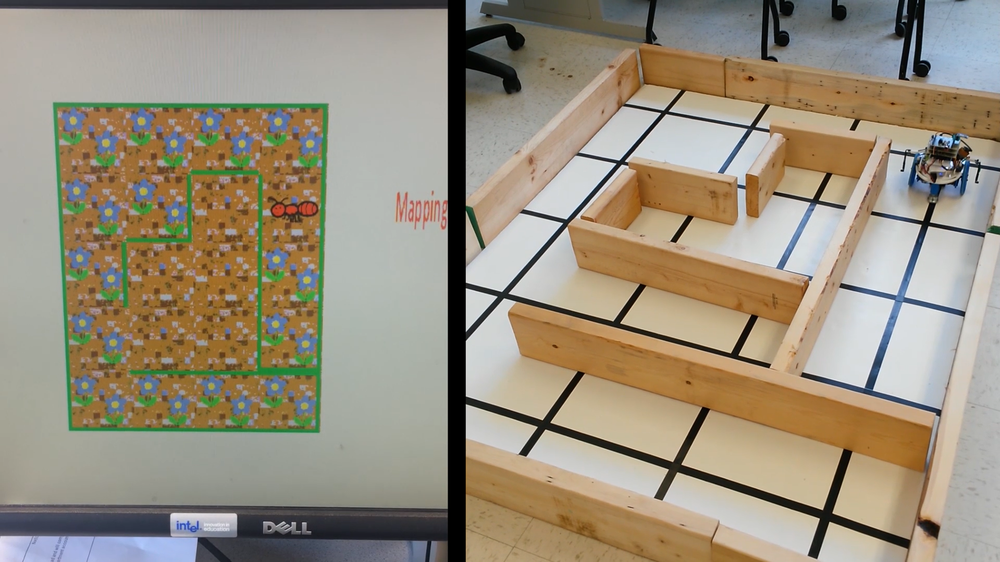

# ECE 3400, Fall'17: Team Alpha

*By Claire Chen, June 10th*

## Milestone 4: Maze-mapping robot
### Goal
The goal of this milestone is to have the robot completely and accurately map a maze, as well as successfully indicate when it has mapped the entire maze.

### Maze Mapping
For milestone 4, we created a maze-mapping robot and a basestation capable of showing the robot's progress. A video of the system can be seen at the bottom of this page.

* The robot portion of this milestone is almost the same as in milestone 3, with the exception of the navigation algorithm. The algorithm is an improved version of the baseline DFS we implemented in milestone 3.
* To transmit data back to the basestation, we integrated our maze-navigation code from milestone 3 with radio-transmission code from lab 4.
* Once we could successfully transmit the robot's coordinates and wall locations to the basestation Arduino, we worked to display this information on the FPGA. We were able to use our Verilog code from lab 4 as the baseline code to display the maze.
* We added additional support to display more complex graphics, display the done signal and mark all the unvisitable grid spaces.

Note: The video does not show the 660Hz tone detection, treasure detection, or the 'done' signal the FPGA must play when the robot has finished traversing the maze. These steps will be added in a future version of this website.
