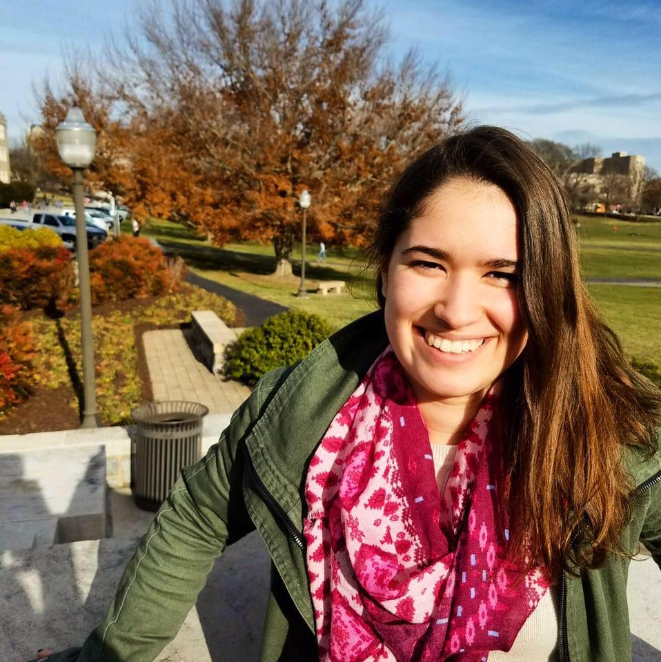
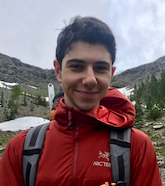

# ECE 3400: Intelligent Physical Systems
## Cornell University, Fall 2018

[Return to main page](https://cei-lab.github.io/ece3400-2018/)

If you have a question that can't be answered by one of the links above, or on the Piazza page, try contacting one of us!

### Instructor: Kirstin Petersen

I am an assistant professor in ECE, with field appointments in ME and CS. I run the [Collective Embodied Intelligence Lab](http://cei.ece.cornell.edu/) with research on bio-inspired robot collectives. Feel free to contact me with any questions/concerns that don't fit Piazza. I'll have office hours 4.30-6pm in PH427 every Monday, but I'll probably also stop by in the beginning of many of the lab sessions. When I'm not designing random robots, I'm all about hiking, kayaking, camping, and getting as far from my computer as possible!

### TA: Haron Abdel-Raziq (lab session: Friday 1.25-4.25pm)

I am a second-year PhD student in ECE, working with Kirstin in the [Collective Embodied Intelligence Lab](http://cei.ece.cornell.edu/). My previous research background is actually mostly in materials/device physics with some experience in the automotive industry (Ford Motor Company). I am currently working on using a specialzed sensor to obtain map information from honey bees. In general, I've worked on a wide variety of research projects including embedded systems for biology applications, "high temperature" superconductors, and magnetic thin films and devices. You are welcome to ask me about research interests in any of these. Outside of school, I have always enjoyed sports, especially soccer and basketball. I am also an avid reader of comics. 

### TA: Ryan O'Hern (lab session: Monday, 1.25-4.25pm)

I am a second-year PhD student in ECE, working with Kirstin in the [Collective Embodied Intelligence Lab](http://cei.ece.cornell.edu/). I am a computer scientist by training, but a passion for building things brought me into ECE and robotics. You can ask me a question about any topic taught in the course. Outside of the lab I can be seen deadlifting in Teagle or on the mats with the Cornell Brazilian Jiu Jitsu Club.

### TA: Thinesiya Krishnathasan (lab session: Wednesday 7.30-10.30pm)

I am an MEng student in ECE, who also did her undergrad here at Cornell in the same department.  My MEng project is to work with Professor Aaron Wagner and see how Machine Learning techniques can be used to compress information.  As an undergrad, I was part of PAN, one of Cornell's Cube-Sat teams, working on the communication subsystem.  I spent most of my summers interning at MITRE working with SDRs (Software Defined Radios).  My interests include communication, information theory, probability, and Math in general. Outside of academics, I love to draw and paint and is always up for a good movie! 

### TA: Alicia Coto (lab session: Monday 1.25-4.25pm)

  

I am a senior studying ECE graduating in December. I spent last year serving as the Navigation Team lead of Cornell's Autonomous Sailboat Team, CUSail. My focus has been on hardware and embedded systems. I spent last summer working at MIT's Lincoln laboratory working with sonar. Outside of class, catch me listening to podcasts, playing boardgames and hiking!

### TA: Jennifer Fuhrer (lab session: Thursday 7.30-10.30pm)

I am a senior ECE undergraduate student who almost became a Mechanical Engineer. Therefore, I am interested in the interaction between physical and electrical systems. I was a mechanical member of CUAUV for three years and I can CAD anything under the sun. In addition, I am an executive member of the Guild of Visual Arts, where I exercise my love of drawing. I also like to hike and travel.

### TA: Logan Horowitz (lab session: Wednesday 7.30-10.30pm)

I'm a senior ECE currently involved in a number of projects with the Collective Embodied Intelligence Lab, designing electronics for studying bees and creating modular robots.  I am also conducting research with the Molnar Group, designing circuit blocks for use on various IC’s and exploring novel energy recovery methods to improve full-duplex radio efficiency.  I am the electrical lead for Resistance Racing: Cornell Electric Vehicles.  I love wrestling, biking, and climbing trees or buildings.

### TA: Alex Katz (lab session: Monday 7.30-10.30pm)

  

I'm a senior in ECE and my interests currently lie on or near the boundary between hardware and software. Specifically I'm interested in solving problems that involve computer architecture, operating systems, and distributed systems. I've done research in both the ECE and CS departments, and am doing distributed systems work with Ken Birman from CS. Outside of school I'm an EMT and a member of Cornell EMS. I also love any combination of trail running, climbing, and skiing. Feel free to say hi if you see me at Lindseth or out for a run!

### TA: Evan Kravitz (lab session: Monday 7.30-10.30pm)

I'm a fourth year undergrad studying ECE with a minor in CS. My interests include computer software/hardware, math, physics, and data science. I do research in the CSL under Prof. Zhiru Zhang, working on developing efficient machine learning algorithms that can be executed on GPUs and FPGAs. I like to bike, run, hike, and eat good food. 

### TA: Yonghun Lee (lab session: Thursday 7.30-10.30pm)

I am a senior majoring in AEP with a minor in ECE. My research interest lies in solid state physics, and I am conducting research at Professor Kyle Shen’s group in the Physics department, working on understanding the metal-insulator transition behavior of antiferromagnets. Outside of school work, I like to lift, walk, and watch movies. 

### TA: Michael Solomentsev (lab session: Friday 1.25-4.25pm)

I'm a ECE senior with big dreams and a bigger heart. I've been working with the CEI lab on grape and computer visions related projects. Lot of experience working on embedded design projects, with an emphasis on signal processing. This semester I'm taking a bunch of analog focused classes. I also run the lab manager of the Maker Lab, out of Phillips 217! Please contact me if you'd like access to that space (mys29). 

