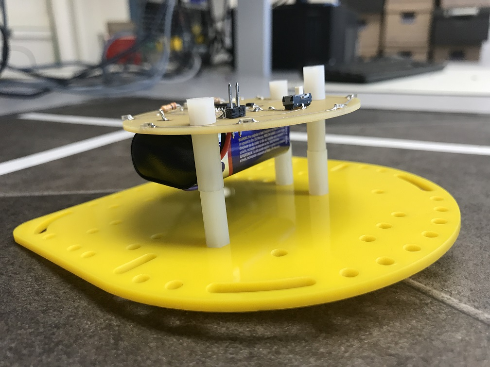
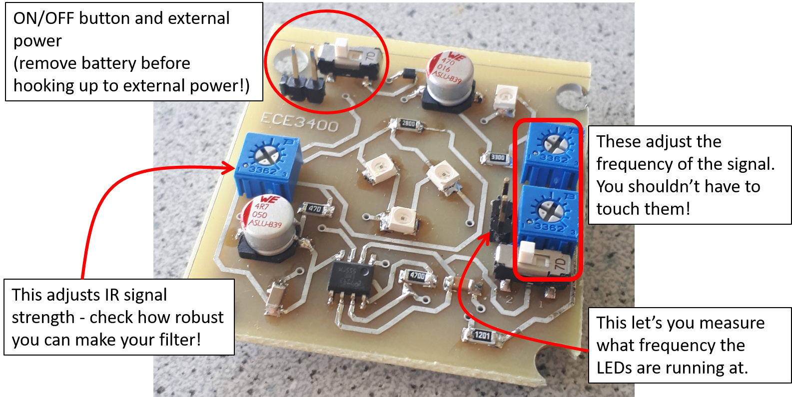

# ECE3400 Fall 2018
## Lab 2: Analog Circuitry and FFTs

### Objective
In this lab, you will add sensors to your robot, and make analog circuits and a digital filter to interface with the Arduino. One is a microphone circuit that will detect a 660Hz whistle blow signifying the beginning of your maze mapping. The other will capture inputs from an IR sensor to detect nearby robots emitting IR at 6.08kHz, and distinguish them from decoys emitting at 18kHz.

### Pre-lab Assignment (for BOTH subgroups)
Before you start your lab, you should have familiarized yourself with the analog-to-digital converter on the [ATmega328](http://www.atmel.com/Images/Atmel-42735-8-bit-AVR-Microcontroller-ATmega328-328P_Datasheet.pdf) (Arduino microcontroller).

You should also have looked over the Open Music Labs Arduino FFT library documentation. If you are unfamiliar with Fourier Transforms and Fast Fourier Transforms (FFTs), be sure to check out online resources or textbooks to review the concepts. Your website will be expected to have a sufficient explanation of the basic FFT algorithm.

Look over the Open Music Labs Arduino FFT library example sketches. You’ll see that they use the internal microcontroller’s Analog-Digital Converter (ADC) as fast as it can convert. Look this up online and see how fast it goes, and then compare that to the Arduino’s analogRead function. Is it necessary to use the ADC directly, or is analogRead fast enough? This will depend on your application (reading a 660Hz sine wave, or 6.08kHz IR signal). What might be some concerns of using either method? What’s the normal range of a human voice? Are the harmonics of human speech an issue? What is the frequency of the fluorescent lights in the room? Can they interfere with your IR sensor?

If you are on audio, it’s a good idea to install an App on your phone that will generate the 660Hz tone for testing. There are many free Apps for this like Tone Generator for example. 

You should also design some simple analog amplifying and filtering circuits so you can add them as necessary once you’re in lab checking out the amplitude of your analog signals. What are some good cutoff frequencies to use in your design? How big of a gain and DC offset is appropriate? (Remember that the Arduino inputs must be between 0 and 5V.) [Check the grading scheme](https://cei-lab.github.io/ece3400-2018/Grading/Lab_score.html).

As always it is a good idea to see old examples of solutions!

### Documentation
Throughout this lab and ALL labs, remember to document your progress on your website. Add anything that you think might be useful to the next person doing the lab. This may include helpful notes, code, schematics, diagrams, photos, videos, and documentation of results and challenges of this lab. You will be graded on the thoroughness and readability of these websites.

Be sure to note on the website what work is carried out by whom. And remember that, if at all possible, you are expected to form different sub teams in every lab.

***

### Procedure

Split into two teams.

The acoustic team will need the following materials:
- 1 Arduino Uno
- Electret microphone
- 1 µF capacitor
- 300 Ω resistors
- ~3 kΩ resistor
- Various other components, as needed

The optical team will need the following materials:
- 1 Arduino Uno
- IR transistor (OP598)
- 1 IR hat (given by TAs)
- 1 IR decoy
- Various other components, as needed

*Please don't grab new Arduino's - use the ones you have!*

#### Download the Open Music Labs FFT library

* Open [Music Labs’ FFT page](http://wiki.openmusiclabs.com/wiki/ArduinoFFT), scroll down and download the newer FFT library folder. Extract this, and then go to My Documents > Arduino > Libraries and put the "FFT" library folder (not the entire "ArduinoFFT3" folder) inside of it. If you have the Arduino IDE open, close it and then restart the program (not the computer) so that it can update accordingly. __WARNING:__ Multiple teams have found that the newest version of the Arduino IDE (1.8.6) is not able to communicate with this library over the serial connection. Version 1.8.5 works fine.

* Use the example sketch to start coding. On the FFT webpage, you will find some good, solid documentation on how to use the library. You should have reviewed this before the lab. In addition, the library you just installed has an example sketch that reads in values from Analog Pin 0 and outputs the frequency bin magnitudes via the serial monitor.

* *Unit Test:* Setup a signal generator to deliver a signal that matches what you expect to see from your sensor. This signal must be between 0-5V to not damage the Arduino. Test that the frequency output from your signal generator matches what you see on the serial monitor.

* Optional: You can, for example, use Matlab to debug your frequencies. Matlab can import values from a serial port and plot a graph of your signal. Use the myserialport = serial(comport, ‘BaudRate’, baudrate_needed) to initialize a serial port. Set the comport parameter to the port that your Arduino is connected to (under Tools>ports in the Adriano program) and the baudrateneeded parameter to 9600. Use the fopen(myserialport) to open the serial port. Read from the port using fscanf(myserialport,’%i’) and plot the value read. Close the port using fclose(myserialport) after you’re done reading.

#### Acoustic Team: Assemble your microphone circuit

The basic circuit for your electret microphone is as follows. It is suggested that you use a 1 µF capacitor and a ~3 kΩ resistor:

* *Unit Test:* Use the app you downloaded during the pre-lab to generate a 660Hz tone. Measure the output from the microphone with the oscilloscope, and try to get an idea of what you need to do to the signal to be able to detect it securely from the Arduino.

* Next, add any additional circuitry you think you need. An amplifier? A analog passive/active filter? If you are adding a circuit you don't need the extra components, just plug one end of the microphone to ground and the other straight into your analog circuitry. Feel free to reference textbooks and the web to decide what circuitry to use. Just be sure that you can fully describe and explain your circuitry choices and how they work when you update your website. Be sure to cite your sources.

* *Unit Test:* Check your circuitry before hooking it up to the Arduino. An amplifier can easily be tested by adding a DC voltage to the input. A filter should be tested by doing a frequency sweep with a signal generator. Once you know that it works, you can test your circuit further by hooking it up to your microphone and checking that the output has a range and a signal-to-noise ratio that works for the Arduino.

* Next, hook up your circuit to the Arduino and try make it detect when you register the 660Hz signal. It is wise to put a ~300 Ω resistor in series with anything you connect to a pin, whether it is an input or an output. This way, if you have set something up incorrectly, it is less likely that you will burn out the pin or any connected components.

* Be aware that during the competition, this circuit must work despite excessive background noise. Your performance will be penalized if you have to start the robot manually and you will get a late start on mapping the maze. Try to recreate this situation during the lab and check if your circuit is robust to audible noise!

* Finally, if you have time to spare, it might be worth implementing an override button right away, such that you can start your robot quickly during the competition in case your microphone circuit fails to recognize the start signal.

* As always, feel free to talk to other groups or a TA if you need assistance!

#### Optical Team: Assemble your IR circuit

Objective: Using an Arduino and the FFT library, detect another robot emitting IR at 6.08kHz, and ignore decoys (18kHz).

* A phototransistor lets more current pass the more light it receives. You can look up the one you have available in this [datasheet](http://www.mouser.com/ds/2/414/OP593-598-6739.pdf) (OP598A). Then connect the sensor as below:

* Grab your IR hat and prop it up 5.5" above the ground; the mounting holes in the PCB fit with the robot base boards. All robots must be carrying an IR hat at the competition, and all of them must be mounted at exactly 5.5" height. They must be mounted in the center of the robot footprint, and the IR LEDs cannot be shaded by wires or other obstacles. On mobile robots they can be powered by a 9V battery; in the lab, we suggest that you hook them up to a power supply instead (think GREEN!).

* *Unit Test:* Power the IR hat and hold your sensor at a realistic difference it (you can check with the maze that is available on your desk), and measure the output of the sensor with the scope. Will you need additional analog circuitry before you pass this on to the Arduino?

* While designing additional amplifiers/analog passive/active filter circuits, feel free to reference textbooks and the web to decide what circuitry to use. Just be sure that you can fully describe and explain your circuitry choices and how they work when you update your website. Be sure to cite your sources.

* *Unit Test:* If you have additional circuitry, be sure to test it before hooking them up to the Arduino. An amplifer can easily be tested by adding a DC voltage to the input and an oscilloscope to the output. A filter should be tested by doing a frequency sweep with a signal generator and an oscilloscope on the output. Once you know that it works, you can test your circuit further by hooking it up to your photo transistor and checking that the output has a range and a signal-to-noise ratio that works for the Arduino.

* Next, hook up your circuit to the Arduino and try make it detect the presence of an IR hat. Remember: It is wise to put a ~300 Ω resistor in series with anything you connect to a pin, whether it is an input or an output. This way, if you have set something up incorrectly, it is less likely that you will burn out the pin or any connected components.

* Finally, take the IR decoy and hook it up to 3V power. 3V, NOT 5V! Again, you can use a coin cell battery, or (recommended) a power supply. First, check that the decoy is actually emitting at 18kHz - if not, contact your TA. Try placing your robot at an intersection in the maze, and place the decoy on a wall next to it. Code up a solution that enables your robot to tell the difference between robots and decoys. Anything goes - it could be a great FFT filter, or some higher level reasoning.

* **Remember to turn off the IR hat and the decoy when you're done using it. You may keep the IR hat in your box after lab, but we recommend ensuring that you get the IR detection circuit working, before you mount your hat permanently on your robot. Alternatively, pair up with another team and make the robots sense each other. (We do NOT have enough boards for everyone to get two). **

* As always, feel free to talk to other groups or a TA if you need assistance!

***

### Wrap-Up and Clean-Up

Keep your Arduino Unos, cables, Parallax servos in the box dedicated for your team. Feel free to keep a maximum of two breadboards in your box as well. All other components can be placed back into their appropriate bins. Clean up your station thoroughly before you leave!

If you decide to use any private parts for your robot, be sure to clearly label them as such. Throughout the semester we will spot check boxes, to ensure that no team has taken more than their share of parts. If your own components are not labeled as such, they will be removed. 

Use GitHub on the computer to upload and save your code, be sure to add appropriate commit messages. The lab computers will NOT keep any data locally (i.e., on them). Once you log off, the data will eventually be lost (typically overnight). Save your data on a flash drive or other means before you leave the lab.

### Grading

You need to document this lab thoroughly on your website, feel free to add ideas/comments this lab inspires regarding your future robot; the TA's will check the website by the deadline noted [here](./schedule.md). Note that to encourage concise and engaging websites, we have a cap on the number of words allowed to discuss lab 2: 2,500 (not including code snippets). You can easily make up for the lack of words by adding figures, photos, and videos with captions! Remember to have a TA note your attendance before heading out.
