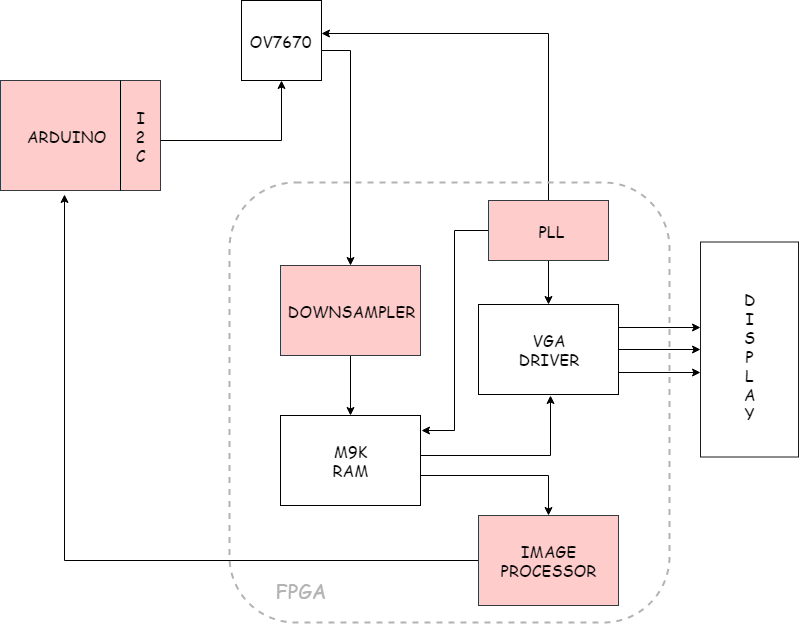
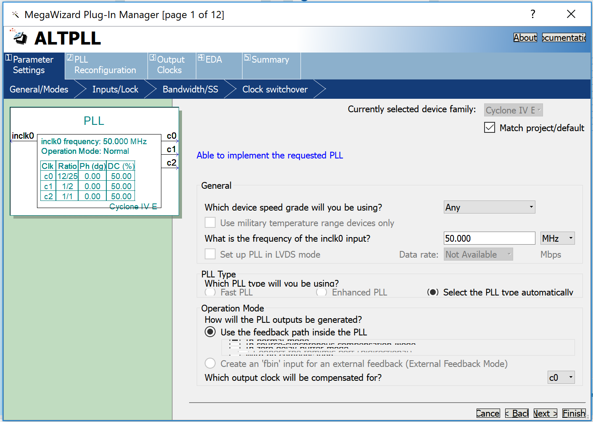
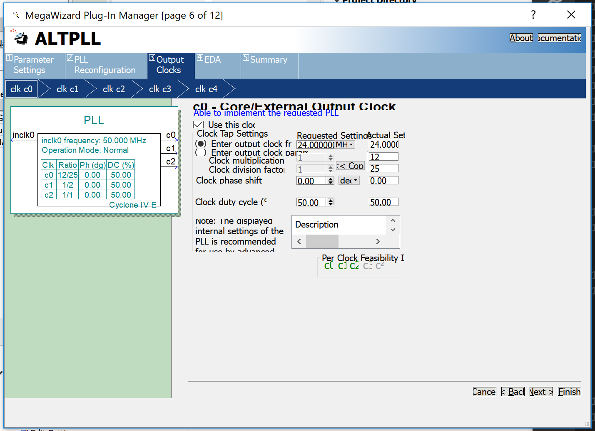
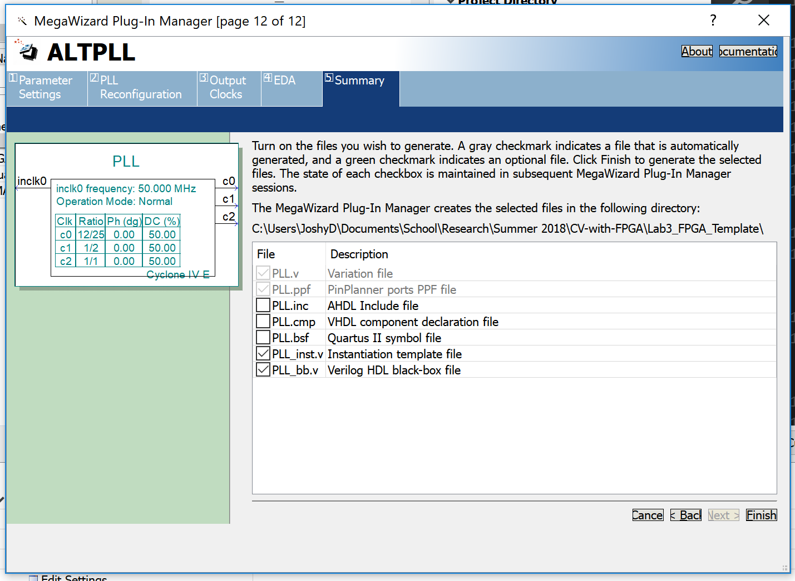
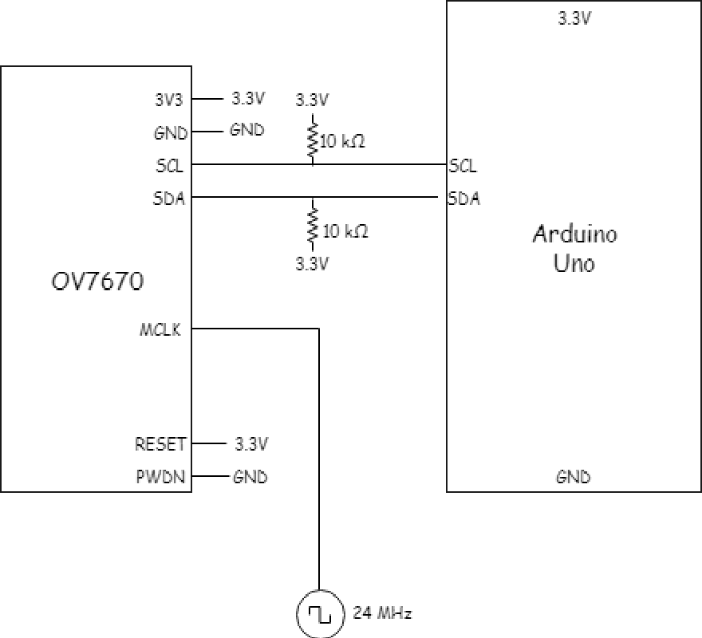
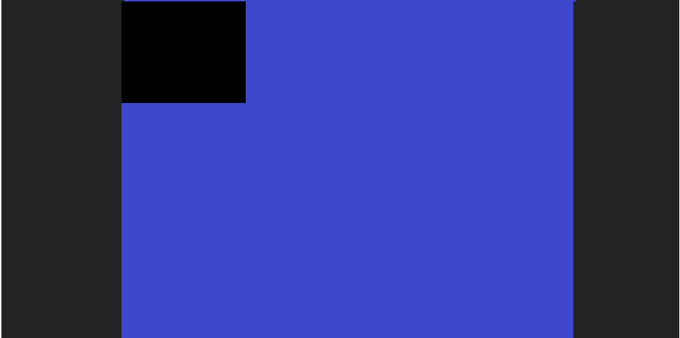
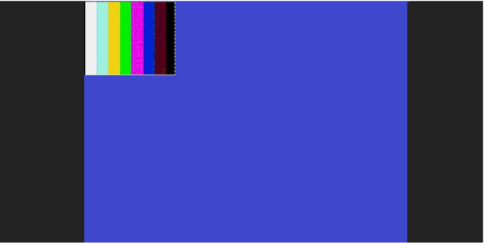
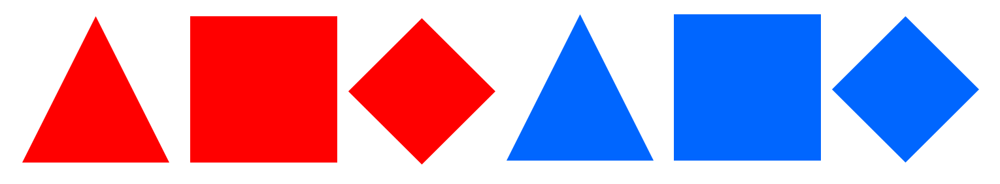

# ECE3400 Fall 2018

## LAB 4 - FPGA and Cameras

### Overview
 In this lab, you will split into two teams to develop an FPGA module capable of detecting basic colors from a camera input, and pass this information on to the Arduino. This device will be mounted on the robot to identify these colors (and eventually shapes) on the walls of the maze.

 Below is a block diagram of the device that will implemented. The red blocks, along with all of the interconnects will be made by you, the white ones are provided.

 

## Prelab

 The FPGA being used is the DE0-Nano. You can find some key portions of the DE0-nano's documentation here:

 * [DE0-Nano Specifications](http://www.terasic.com.tw/cgi-bin/page/archive.pl?Language=English&CategoryNo=165&No=593&PartNo=2 "Specs")

 * [DE0-Nano User Manual](http://www.ti.com/lit/ug/tidu737/tidu737.pdf "The Manual")

 **The expansion headers on page 18 of the manual will be particularly useful for planning GPIO from the FPGA to both the Arduino and the camera. Remember that the FPGA runs on 3.3V - you should *never* connect any I/O pins to the ATmega without a voltage divider in between. Furthermore, be sure to check the outputs from your FPGA. We have some 5V versions floating around which you cannot use without a voltage divider to the camera.**

 To setup the OV7670 digital camera, you will need to get acquainted with its datasheet here:

 * [OV7670 Datasheet](http://web.mit.edu/6.111/www/f2016/tools/OV7670_2006.pdf "Camera stuff")
 * Here's an [extra tutorial](https://cei-lab.github.io/ece3400-2018/tutorials/Camera/) you can check to help prepare you for using the camera.

 In order to perform image processing (for your treasure detection), it is useful to store the image data in a *memory buffer*. Given that the buffer can hold all the pixel data for exactly one image at a time, reading from it is equivalent to scanning through the pixels of the image in one frame of the image output from the camera. No buffer exists onboard the OV7670, so one must be created on the DE0-Nano using its onboard **embedded memory**. This embedded memory consists of M9K memory blocks that you can configure to create a RAM. One caveat of this is that each entry in the RAM must have a size of 8 or 9 bits.

 You will use a VGA adapter to connect to a display for debugging (to ensure your image comes out properly). The adapter takes pixel data in RGB 332 format (8 bits - 3 red, 3 green, 2 blue). 

 The OV7670 camera requires being setup every time the camera is powered on. This involves setting registers in the camera, which can be done over the Arduino's I2C interface. The camera also requires a clock input. Lastly, it has an active-low reset pin and a power-down pin. Outputs of the camera include 8 pins for 8b data output and 3 signals for sampling: PCLK(pixel clock), HS(HREF), and VS(VSYNC).
 
* HREF indicates the start (rising edge) and end (falling edge) of a row of pixels in an image.
* VSYNC indicates the start (falling edge) and end (rising edge) of a frame of an image
* PCLK decides the speed at which the data output is being transmitted. Its rising edge indicates a new byte is ready to read.

 ### Questions

  #### *Q1:*  
  Reviewing the FPGA's specifications, what is the maximum size of buffer that you can create? Given that each entry is, how many entires large can the RAM be?  

  #### *Q2:*  
  The OV7670 offers a variety of pixel formats to sample data at (see: Output Formats in "Key Specifications" table). Which of the formats available provides the most info on the base colors making up each pixel?  

  #### *Q3:*  
  Given that the input to the VGA adapter is RGB 332. How can you convert (downsize) the pixel format from *Q2* to be accepted by the VGA module? 

  #### *Q4:*  
  Now that you know the downsized memory per pixel (from Q3), you need to know how many you can fit in memory. Which of the predefined resolutions that the OV7670 supports provides the max amount of pixels in an image, given the constrained max size of the buffer (from *Q1*)? What's the size of the buffer?  

  #### *Q5:*  
  Using the Register Set table on pages 10-23 of the OV7670 datasheet, find the registers you will need to set to do the following:  
  - Reset all registers
  - Enable scaling
  - Use external clock as internal clock
  - Set the camera to output the resolution you specified in *Q4* and the pixel format you specified in *Q2*.(Note: The pixel format will take setting an extra register to fully specify)
  - Enable a color bar test (takes setting 2 regs, neither of them are the SCALING regs)
  - Vertical and mirror flip the output image (optional: it's not necessarily needed but could be useful)  
  - As we discussed in class, you may also want to fix, e.g. the gain (Automatic Gain Ceiling) and other parameters of the camera 

  **Make sure to keep track of each register's name, address(hex), and value(hex).**  

  #### *Q6:*  
  Take a look at the timing diagrams (Fig 5 and 6) on Page 7 (Ignore HSYNC, you won't use it). Use both diagrams to determine when you should sample your data. (Hint: You only want to sample valid bytes, and each one only once) 

  #### *Q7:*
  Discuss with your entire team, what method you want to use to communicate information from the FPGA to the Arduino. Parallel? Serial? Maybe take a look at team Alpha's write up of their Lab 3.

## Lab
  To begin, grab an OV7670 camera and two DE0-Nano FPGAs for your team. (Note that until the Lab 4 deadline has passed, you do not get to keep these in your box, because we do not have enough boards for all 30 teams to keep two). 
  
  You will need to split into two teams to complete this lab. Team Arduino will set up the OV7670 camera using the Arduino, and work on getting info from the FPGA to the Arduino. Team FPGA will work on creating a downsampler in Verilog, writing an image to the VGA display, and detecting the color of the image. Once *both* teams are done, you should work to combine the two, display the camera's image to the display, and detect (through the FPGA to the Arduino) when blue and red pixels are in front of the camera. 

### PLL
 Each team will need a clock to run their respective devices and both teams should perform the following steps.
 
 The camera can be driven with a 24MHz MCLK (External clock) and the VGA module requires a 25MHz clock to drive the screen. RAM also uses read and write clocks. 

 The FPGA can generate a 50 MHz Clock called CLOCK_50. You can divide this in logic, however, this approach is succeptible to clock skew and it is much more pragmatic to use a *Phase-locked loop (PLL)*. This will ensure that the clocks are treated in the FPGA as actual clock lines, and that they remain locked in phase, preventing skew. To use one of these, you should use a piece *Altera* IP that comes with Quartus II.

 #### Download Template

* You first need to download the template for the Quartus II project. You can download that here:
[Lab 4 FPGA Template](./Lab4_FPGA_Template.zip)

* Unzip this folder and put it somewhere you'll remember.

#### Open Project
  
* Open Quartus II on the lab computer.   
  
*  Go to *File>Open Project* and open the folder you unzipped, in there select the "DE0_NANO.qpf" project.  
  The top file is called DE0_NANO.v; this is where the FPGA team will work.  

#### To create our PLL
  1. Navigate to *Tools>IP Catalog* to bring up the IP Catalog 
  2. In the window that pops up, click *Library>Basic Functions>Clocks; PLLs and Resets>PLL*  
  3. Double click *ALTPLL*  

  4. In the pop-up, name the IP variation file whatever you'd like. Make sure you use a Verilog IP. 
  

  5. In the General Modes tab, set the device speed to *Any* and the frequency of inclk0 to *50MHz*, as below.
  

  6. In the **Inputs/Lock** tab deselect everything

  7. In the **Bandwidth/SS** tab only click the *Auto* bubble

  8. In the **Clock Switchover** tab deselct everything

  9. You can skip over to **Output Clocks** now. You'll be setting up *clk c0*, *clk c1*, and *clk c2*. 

  

  10. For c0, select *Use this clock*. Also select *Enter output clock frequency* and set it to *24.0 MHz* as the Requested Setting. Make sure you set the clock duty cycle to *50%*.

  For c1, select *Use this clock*. Also select *Enter output clock frequency* and set it to *25.0 MHz* as the Requested Setting. Make sure you set the clock duty cycle to *50%*.

  For c2, select *Use this clock*. Also select Also select *Enter output clock frequency* and set it to *50.0 MHz* as the Requested Setting. You are making this clock, despite having CLOCK 50 as the reference clock, for the others to always be phase-locked to. As such, you should be sure to use this clock instead of CLOCK_50. Make sure you set the clock duty cycle to *50%*.

  11. Jump to the summary tab and select *nameyouchose*_inst.v and *nameyouchose*_bb.v. Your design should look like the block on the left of the picture below.

  

  Click **Finish**

  13. Go to *File>Open>folder_your_project_is_in*, and you should be able to open your *nameyouchose*_inst.v file. Pasting this into your top level module will allow you access to these clock signals. Remember to input 50MHz, and then create wires for each of the outputs. 

  You'll want to assign the 24MHz output to a GPIO pin, for Team Arduino to use.

### Team Arduino
 Congrats, you're on Team Arduino. You will be responsible for wiring the camera, setting up its registers with the Arduino, and reading in treasure data from the FPGA. 

 So grab the OV7670, your Arduino, an FPGA, and get to work.

 First, study and download the template Arduino code provided here:

 [Lab 4 Arduino Template](./Lab4_Arduino_Template.zip)

 In order for the provided functions to work, you need to set up the Arduino's I2C interface. This will require wiring the Arduino's SDA and SCL pins to the camera's, and setting the camera up as a slave peripheral.

#### **EXTREMELY IMPORT PART TO NEVER, EVER, FORGET**
  Every time you start a new lab session, **BEFORE** uploading **ANY** code to your Arduino that includes what's in the template, you have to disable the internal pull-up resistors that are a part of the Arduino's I2C interface. This is because they pull the signals that set up our camera to 5V, while our camera requires 3.3V. Sending 5V through will harm the camera. 

  To disable these in Windows:
  (To disable them in Mac, please see [here](./lab4_MacNote.md) )
  
  1. Go to *twi.c* at *C:\Program Files (x86)\Arduino\hardware\arduino\avr\libraries\Wire\src\utility*

  2. Right click the file and do *Properties>Securities>Edit*
  * Click *Users*
  * Click *Full Control*
  * Click *OK* and *Close*
  3. Open *twi.c* 
  4. Comment out the following lines
  ```C
  //activate internal pullups for twi
  digitalWrite(SDA,1);
  digitalWrite(SCL,1);
  ```
  5. Save the doc and close.

  Now you'll need to wire the Arduino to the OV7670 camera. You should wire power and the I2C interface - all data pins will have to go into the FPGA when you integrate. 

  Here's what you'll want to do:

  
**Note that the pin names on the camera might be slightly different than the diagram above (SIOC <-> SCL, SIOD <-> SDA, MCLK <-> XCLK).**

 #### Writing Registers 
  Next you'll need to make use of the functions in the template code to write the values of the registers from the prelab to the values expected.
  Note that you'll need to write the slave address (in hex) found in the datasheet into the code (Define statement at the top). These addresses use the **least significant bit** to distinguish between read and write(0->Write, 1->Read). Arduino's Wire library uses different commands for read and write however, and appends that bit to the end of the address you use. You have to figure out what the proper address is to send to the Arduino. **That means the address that you give the Arduino I2C library should not include the lsb**. That is, the read/write addresses you get from the datasheet are the seven bit I2C addresses plus a 1 or a 0 depending on whether it's a read or write address. So just give the arduino library the upper seven bits.
  
*Unit check:*  When writing the registers, you'll want to make sure you actually addressed the right registers by checking them after you write. You can read the value of a register using *read_register_value()*. You can also add something more intelligent to the routine called *read_key_registers* such that it automatically outputs what you have written 

  Note that all values will be read in hexadecimal format. All addresses and write values should also be written in hex. Be sure you specify that format in your code (eg. 0xAB).

  Lastly, you'll want to call the *set_color_matrix()* function in your code. This sets a group of registers responsible to ensuring the colors from your camera come out properly.

#### Communicating with the FPGA
  Next, you'll need to create a system to pass information (about treasure presence, color, and shape) from the FPGA to the Arduino using the digital ports on both of these devices. You can send the information serially or through a parallel bus, but be sure to consider timing and other concerns when determining this. Again, be aware that the DE0-Nano operates at 3.3 Volts, but the Arduino Uno outputs 5 volts on its digital pins. Therefore, you will need to have a voltage divider for each wire connected from the Arduino to the FPGA. You will also need a common ground. Confirm with the TA’s that your choice of resistors is adequate before hooking everything up.

The final step is to create a protocol for the information that is being sent, and to interpret the information on the Arduino’s side of communication. You can show that your system is working, by e.g. lighting different LEDs depending on the treasure, or transmitting serially to a separate screen. 

### Team FPGA

 Congrats, you're on Team FPGA. Grab the DE0-Nano and the VGA adapter, and get to work! 
 You'll be responsible for writing data into the provided Dual_Port M9K RAM, reading it out to the VGA display, and detecting the color of the bits in the RAM. 
 
 NOTE: If you want to use the non-volatile memory to store your bit-stream, [try this out](https://unboxnbeyond.wordpress.com/2013/05/11/configuring-de0-nano-epcs64-flash-device/). I haven't tested the directions there, so it may require a bit of modification, but overall it looks about right. 

#### Setup

  Open the Verilog project you downloaded before. Notice the *SCREEN_WIDTH* and *SCREEN_HEIGHT* defined at the top. Make sure these match the resolution you expected to get as part of your prelab. You should also define what RED, GREEN, and BLUE are as local parameters, they can be useful for writing a test pattern.

  You'll notice the Memory and VGA Driver are already created in the top-level DE0-Nano module. You'll need to input clock signals for them to work. Recall that VGA requires a 25MHz signal to output to the monitor. The memory can use any clocks but they must be different between read and write as you **cannot** read and write from the same address at the same time. (That would give you indeterminate data when reading.) 

  Before continuing, you'll want to connect the VGA adapter to the FPGA's GPIO pins (GPIO_0[5] -> GPIO_0[23]). Use the FPGA's User Manual above to figure out which ones these are. Notice that the VGA adapter has a pin labeled *G*, this needs to be connected to the FPGA's ground.

  The M9K RAM module will write to the memory address assigned to the *MEM_WRITE_ADDRESS* wire at the posedge of *clk_W*, if  *W_EN* is HIGH. It will also constantly read out the value of *MEM_READ_ADDRESS* to the *MEM_OUTPUT* wire at the rate of *clk_R*. This address is currently updated in the always block at the end of the module. The VGA Driver outputs the coordinates of the next pixel (*PIXEL_X*, *PIXEL_Y*) on the clock posedge. On its next clock cycle it takes the color (*PIXEL_COLOR_IN*) that corresponds to that coordinate, and displays it to the screen. 

  The *Update Read Address* block updates *MEM_READ_ADDRESS* by assuming that the pixels are stored one pixel per memory address, and that they are stored sequentially. This means that, e.g. if your image has 176 pixels in a horizontal line, then a pixel at (175,0) would be stored at address 175, and pixel (0,1) at address 176. If you read the *VGA_DRIVER.v* module, you'll notice that the driver is configured to work for full VGA resolution (640 x 480). This means the VGA driver will output values for *PIXEL_X* and *PIXEL_Y* outside of our resolution (and thus outside of our RAM). For this reason the template includes a *VGA_READ*_MEM_*EN* so that only when a pixel is within the bounds of our predefined *SCREEN_WIDTH* and *SCREEN_HEIGHT*, will it output the pixel assigned to *VGA_COLOR_IN* to the VGA driver. Otherwise it outputs *BLUE*. 

  With nothing driving *VGA_COLOR_IN*, it'll look something like this:

  

#### Buffer Reader

  Your job is to connect the M9K RAM to the VGA Driver and write a test pattern to the contents of the memory. Some useful patterns to write are crosses (like the English flag), or linear gradients. You will then verify that your test pattern is properly output to the screen.

#### Downsampler

  The OV7670 Camera can only output 8 bits of a pixel at a time through D7 - D0. One pixel of color takes more than 8 bits (depending on the resolution you chose in the prelab), thus requiring more than one clock cycle to output a pixel. Notice in the timing diagrams for the OV7670 that the camera outputs 1 pixel of data over two clock cycles - 8bits at each posedge. Missing just one of these cycles will lose some information, so you must determine when to sample the input data and update memory so that nothing is lost. Make sure you only sample when data is valid (Prelab *Q6*). Remember that although each pixel is output with 16bits from the camera, you can only store 8bits per pixel (for each entry in our RAM), so you will have to downsize the resolution. You should know which pixels to strip away, and which to keep according to your prelab.

#### Color Detection

  Next, work similar to how you did so before. Read data out of the RAM and into the image processing module. We have provided an IMAGE_PROCESSOR.v file, though one look into it will reveal that it's pretty much empty. Your job is to detect whether or not the pixels are majorily red or blue. It may be helpful to use the onboard LEDs to indicate what the modules finds. Try experimenting with different thresholds and different noisy pictures. 
  
### Integrating

 Nice work. Now you'll be integrating the two portions. This will involve taking the actual data from the OV7670, saving it into memory (using the FPGA team's Downsampler), and showing that you can write it to the display, and detect the color of the majority of the pixels. Team Arduino should have set the camera to output a color bar test, so the output ought to look something like so:

 

 If it is not, the registers may be set incorrectly. If it looks somewhat resemblant of the photo, but skewed or 'negative', the downsampler is likely the culprit. If the buffer reader portion of Team FPGA's part came out fine, it's highly unlikely that the problem lies in the RAM-VGA driver-Display portion of the Verilog module.

 Once the color bar comes out well, toggle off the registers that are enabling the color bar test. Your image may need to be focused, which you can do manually by turning the camera's lens. You may also need to be sure that there is adequate lighting in the room. 

 Once your image is clear, move on to test your image processing.

### Thinking ahead.

For this lab, you just need to show that you can detect the color of the pixels. However, you should think ahead on how you want to implement the full treasure detection, and how you want to integrate the FPGA on the robot. 

The treasures will always be mounted on walls. The wall heights are 6", the treasures are 1.5x1.5" in size. The lowest point of the treasure will be located 3.5" from the ground, the middle 4.25" from the ground, the top 5" from the ground. They will be placed horizontally symmetric around a white line on the floor.

Here are the treasures you should be able to detect:

 

 As discussed in class you can get far with pretty simple measures. You will need to use the pixel data saved in RAM from your camera to detect the different colored shapes shown above on the walls of the final maze. Feel free to edit any part of the code from previous portions of this lab if you wish, though it is not required. Note that you might be able to do better image processing if you downsample to RGB323 (leaving more resolution to the red and blue colors of the treasures) instead of RGB332 as the VGA monitor requires.

 The image processor should output if it has detected a shape, and which shape/color. This output should then be sent to the Arduino, where you'll want to verify its value by outputting to the Serial monitor. 

 During the competition, your Arduino, FPGA, and camera will be mounted on your robot. Make sure that you can power everything from your battery. AGAIN remember that the FPGA is powered by 3.3V. Do NOT give it more! 

### Wrap-Up

Keep your Arduino Unos, cables, Parallax servos in the box dedicated for your team. Feel free to keep a maximum of two breadboards in your box as well. All other components can be placed back into their appropriate bins. Clean up your station thoroughly before you leave!

If you decide to use any private parts for your robot, be sure to clearly label them as such. Throughout the semester we will spot check boxes, to ensure that no team has taken more than their share of parts. If your own components are not labeled as such, they will be removed.

Use GitHub on the computer to upload and save your code, be sure to add appropriate commit messages. The lab computers will NOT keep any data locally (i.e., on them). Once you log off, the data will eventually be lost (typically overnight). Save your data on a flash drive or other means before you leave the lab.
 
